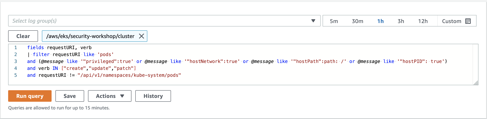
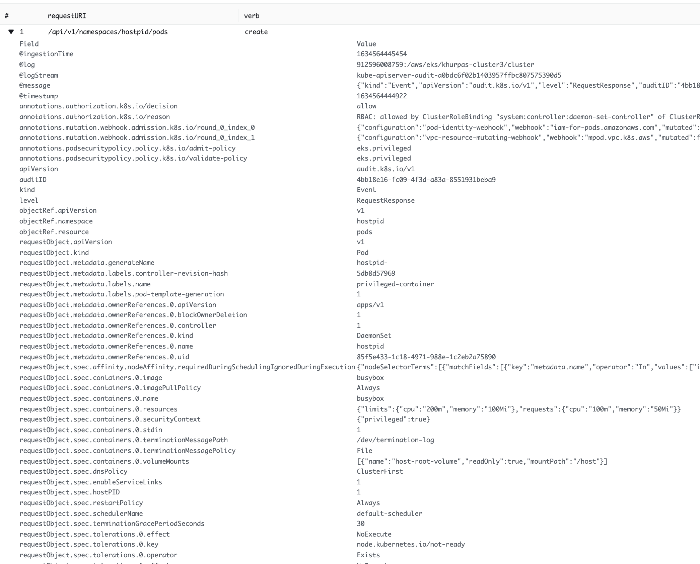

# CloudWatch Logs Insights
CloudWatch Logs Insights enables you to interactively search and analyze your log data in Amazon CloudWatch Logs, including the Kubernetes Audit log. The audit log, part of the EKS Control Plane logs, keeps a record of the calls issued against Kubernetes API server. Aside from logging the API call, the audit log reveals the ID of the caller. This can be particularly useful during a forensics investigation where you're trying to determine who did what and when. 

Using Log Insights, you can perform queries to help you more efficiently and effectively respond to operational issues. If an issue occurs, you can use CloudWatch Logs Insights to identify potential causes and validate deployed fixes.

CloudWatch Logs Insights includes a purpose-built query language with a few simple but powerful commands. CloudWatch Logs Insights provides sample queries, command descriptions, query autocompletion, and log field discovery to help you get started. Sample queries are included for several types of AWS service logs.

A single request can query up to 20 log groups. Queries time out after 15 minutes, if they have not completed. Query results are available for 7 days.

You can save queries that you have created. This can help you run complex queries when you need, without having to re-create them each time that you want to run them.


## Run a CloudWatch Logs Insights query
To run a CloudWatch Logs Insights sample query

1. Open the CloudWatch console at https://console.aws.amazon.com/cloudwatch/.

2. In the navigation pane, choose Insights. Near the top of the page is the query editor. When you first open CloudWatch Logs Insights, this box contains a default query that returns the 20 most recent log events.

3. Select one or more log groups to query, above the query editor. To help find your log groups, you can enter text in the search bar and CloudWatch Logs displays matching log groups in the search bar.

4. When you select a log group, CloudWatch Logs Insights automatically detects fields in the data in the log group. To see these discovered fields, select Fields on the right of the page.

5. (Optional) Use the time selector at the upper right to select the time period that you want to query.

6. Choose Run. The results of the query appear. In this example, the results are the most recent 20 log events of any type. CloudWatch Logs also displays a bar graph of log events in this log group over time. This bar graph shows the distribution of events in the log group that matches your query and time range, not just the events displayed in the table.

7. To see all fields of one of the returned log events, choose the icon to the left of that log event.

## Create and Run a CloudWatch Logs Insights query to discover privileged pods
1. Open the CloudWatch console at https://console.aws.amazon.com/cloudwatch/.

2. In the navigation pane, choose Logs Insights. You can find "Logs Insights" under the "Logs" section on the navigation pane.

3. Select the log group associated with your EKS cluster above the query editor. e.g: /aws/eks/_**my-eks-cluster**_/cluster. In this example the EKS cluster name is "**my-eks-cluster**". Find the log group associated with your EKS cluster. To help find your log groups, enter text in the search bar and CloudWatch Logs displays matching log groups in the search bar.

4. (Optional) Use the time selector at the upper right to select the time period that you want to query.

5. In the query editor, delete the query that is currently shown, enter the following, and then choose Run. 

    ```
    fields requestURI, verb
    | filter requestURI like 'pods' 
    and @message like '"privileged":true' or @message like '"hostNetwork":true' or @message like '"hostPath":path: /' or @message like '"hostPID": true'
    and verb in ["create","update","patch"] 
    and requestURI != "/api/v1/namespaces/kube-system/pods"
    ```

    

6. The results show the log events that were received by CloudWatch Logs that contain logs from the kube-api-server as it created, updated and patched privileged pods. i.e. any pods that were created through a deployment or a pod manifest and has any of the following attributes in its specification.

    * privileged: true
    * hostNetwork:true
    * hostPath: path: /
    * hostPID: true

7. To see all the fields of one of the returned log events, choose the icon on the left of that log event.

    


# Additional Information:
- Analyzing log data with CloudWatch Logs Insights. https://docs.aws.amazon.com/AmazonCloudWatch/latest/logs/AnalyzingLogData.html
