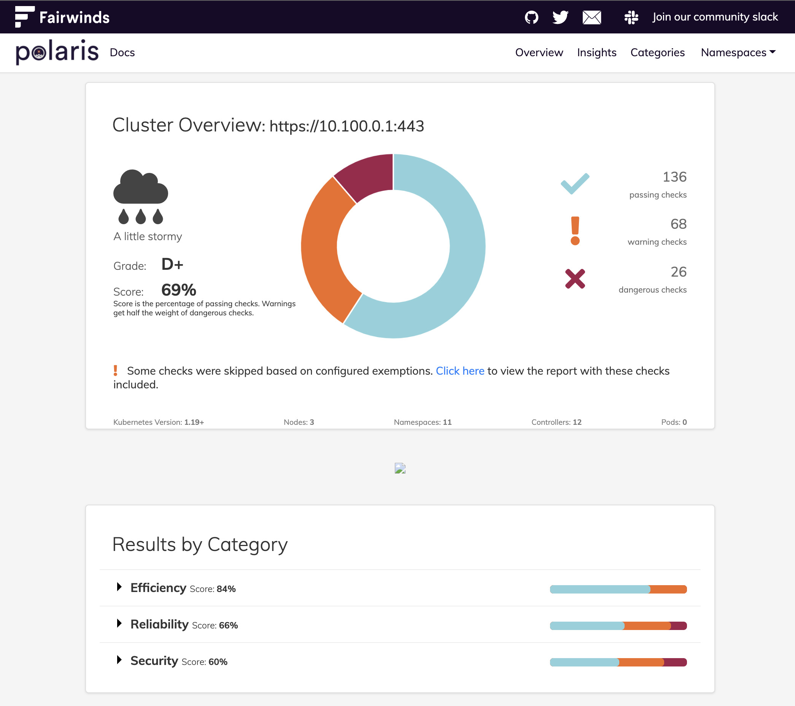
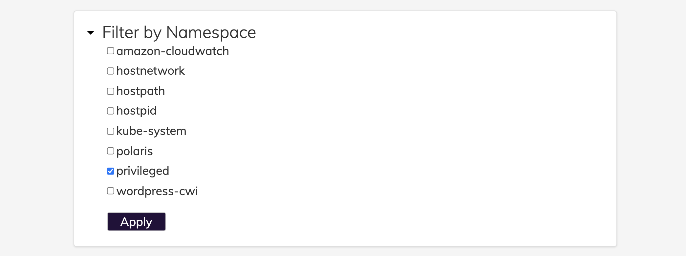
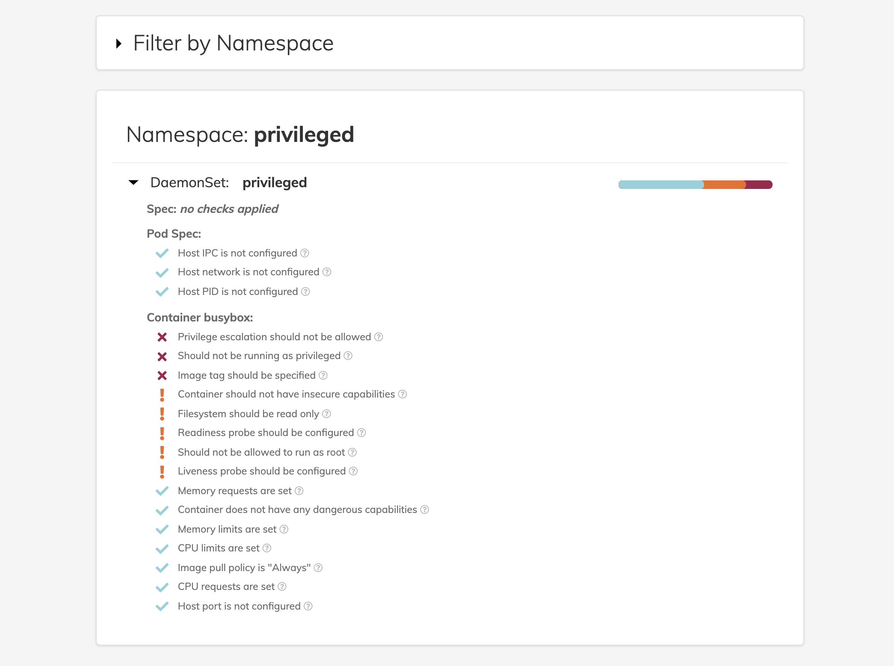

# Polaris By Fairwinds
Polaris is an open source project that identifies Kubernetes deployment configuration errors. It is part of the **detection and analysis** phase of an incident response plan. Polaris runs over a dozen different checks to help users discover Kubernetes misconfigurations that frequently cause security vulnerabilities, outages, scaling limitations and more. Using Polaris, you can avoid problems and ensure you’re using Kubernetes best practices.

# Background
Securing workloads in Kubernetes is an important part of overall cluster security. The overall goal should be to ensure that containers are running with as minimal privileges as possible. This includes avoiding privilege escalation, not running containers as the root user, not giving excessive access to the host's network namespace, and using read only file systems whenever possible.

Much of this configuration can be found in the securityContext attribute for both Kubernetes pods and containers. Where configuration is available at both a pod and container level, Polaris validates both.

# Security
These checks are related to security concerns. Workloads that fail these checks may make your cluster more vulnerable, often by introducing a path for privilege escalation.

|              key              | default |                     description                     |
|-------------------------------|---------|-----------------------------------------------------|
|          hostIPCSet           | danger  | Fails when hostIPC attribute is configured.         
|          hostPIDSet           | danger  | Fails when hostPID attribute is configured.         
|   notReadOnlyRootFilesystem   | warning | Fails when securityContext.readOnlyRootFilesystem is not true.
| privilegeEscalationAllowed    | danger  | Fails when securityContext.allowPrivilegeEscalation is true.
|      runAsRootAllowed         | warning | Fails when securityContext.runAsNonRoot is not true.
|      runAsPrivileged          | danger  | Fails when securityContext.privileged is true.
|    insecureCapabilities       | warning | Fails when securityContext.capabilities includes one of the capabilities listed [here]("https://github.com/FairwindsOps/polaris/blob/master/checks/insecureCapabilities.yaml")  |
|    dangerousCapabilities      | danger  | Fails when securityContext.capabilities includes one of the capabilities listed [here]("https://github.com/FairwindsOps/polaris/blob/master/checks/dangerousCapabilities.yaml") |
|     hostNetworkSet            | warning | Fails when hostNetwork attribute is configured.
|      hostPortSet              | warning | Fails when hostPort attribute is configured.
|    tlsSettingsMissing         | warning | Fails when an Ingress lacks TLS settings.

# Installation
Fairwinds' Polaris helps keep your clusters operating smoothly. It runs a variety of checks to ensure that Kubernetes pods and controllers are aligned with best practices, helping you avoid problems in the future.

Polaris can be run in three different modes:

* As a dashboard, so you can audit what's running inside your cluster.
* As an admission controller, so you can automatically reject workloads that don't adhere to your organization's policies.
* As a command-line tool, so you can test local YAML files, e.g. as part of a CI/CD process.

We will install Polaris in the dashboard mode. The dashboard is a good way to understand what workloads inside your cluster or Infrastructure as Code don't conform to best practices.

We will use [Helm](https://helm.sh/) to install the Polaris dashboard.

```
helm repo add fairwinds-stable https://charts.fairwinds.com/stable
helm upgrade --install polaris fairwinds-stable/polaris --namespace polaris --create-namespace
kubectl port-forward --namespace polaris svc/polaris-dashboard 8080:80
```

Note : kubectl port-forward does not return. You can open a browser instance with the url https://localhost to browse the Polaris Dashboard.

# Using the Dashboard
The Polaris dashboard is a way to get a simple visual overview of the current state of your Kubernetes workloads as well as a roadmap for what can be improved. The dashboard provides a cluster wide overview as well as breaking out results by category, namespace, and workload.

 
 
The Polaris default standards are rather high, so don’t be surprised if your score is lower than you might expect. A key goal for Polaris was to set a high standard and aim for great configuration by default. If the defaults are too strict, it’s easy to adjust the configuration as part of the deployment configuration to better suit your workloads.

# Interpret the results from the Dashboard
1. You can use the "Results by Category" dropdown to select the namespaces that you want to filter on.  The following example shows a filter applied to the **privileged** namespace.

    

2. Once the filter is applied, you can see a summary that is color coded to identify the concerns ( if any ). The following screen grab shows the areas of concern with the "X" mark in "red" color.

    


# Additional Information:
- Polaris https://polaris.docs.fairwinds.com/


