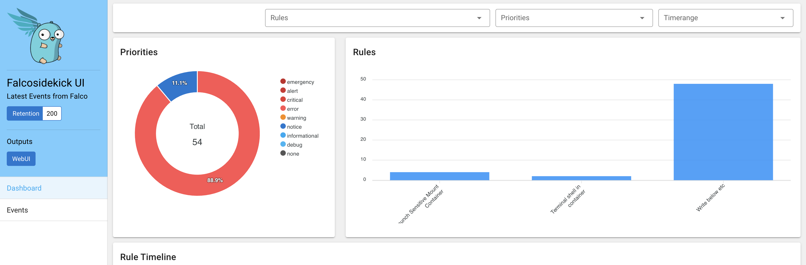
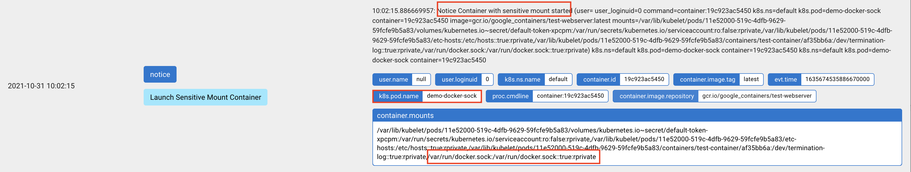

# Introduction
Running multiple containers on the same host exposes the platform to different security threats like _container breakouts_, _noisy neighbor and DOS_, among others. As the popularity of containers and Kubernetes continues to grow, it is increasingly important to have a runtime solution in place to mitigate security threats to your environment. Technologies like _gVisor_ and _Kata Containers_ try to isolate containers by sandboxing them, however, this approach has a few limitations as well as performance issues. In this workshop we will look at **Falco** which ensures that containers adheres to a pre-defined set of security standards and quickly remediates potential security threats.

## Falco
[Falco](https://github.com/falcosecurity) is an open-source runtime security tool originally built by [Sysdig](https://sysdig.com). It was donated to CNCF in 2018 and promoted to incubator status in 2020. Falco traces Linux system calls, evaluates those calls against rules you specify, and takes action when a rule is violated.

### Architecture
Falco consumes events from both the Linux kernel and Kubernetes audit events. It has three kinds of drivers:
1. A custom Linux kernel module that is compiled via DKMS and dynamically loaded into the kernel. This is the current default.
2. An eBPF probe targeted at newer Linux kernels. The eBPF probe is compiled using LLVM and loaded into the Linux kernel. It provides an alternative to the Falco custom kernel module.
3. A userspace instrumentation layer.

***


Falco loads its defined rules and scans the event based on the rules in the rule engine. When the filter engine detects a suspicious event, Falco sends the event for alerting to one or many channels:
- File
- Shell
- Standard I/O
- A spawned program
- HTTP/S
- TLS/gRPC

For details, see the [documentation](https://falco.org/docs/alerts/).

### Rules
Falco rules are written in YAML and follows `tcpdump` syntax. It contains three types of elements:
- Rules: Conditions under which an alert should be generated
- Macros: Rule condition snippets that can be re-used inside rules and even other macros
- Lists: Collections of items that can be included in rules, macros, or other lists

#### Example:

```yaml
- rule: shell_in_container
  desc: notice shell activity within a container
  condition: evt.type = execve and evt.dir=< and container.id != host and proc.name = bash
  output: shell in a container (user=%user.name container_id=%container.id container_name=%container.name shell=%proc.name parent=%proc.pname cmdline=%proc.cmdline)
  priority: WARNING
```

This rule will alert whenever `bash` is spawned inside a container.

Details about rules can be found in the [Falco documentation](https://falco.org/docs/rules/).

# Deploy Container Runtime Security using Falco for EKS
In this section, we will deploy Falco to detect and report security violations. Falco can be installed on EC2 instances directly using a Linux package manager such as `yum` or `apt-get`, or using a tool such as Helm to automate the installation on all your worker nodes.

## Install Falco Helm Chart
From the Cloud9 workspace:

```
cd ~/environment/eks-security-compromised-cluster-remediation/Implement_Countermeasures/falco/
helm repo add falcosecurity https://falcosecurity.github.io/charts
helm repo update
kubectl create namespace falco
helm install falco falcosecurity/falco -n falco -f values.yaml
```
All the necessary customizations are in the `values.yaml` file. Open the file using Cloud9's built-in file browser and examine it.

## Falcosidekick

Falcosidekick helps to build a threat response system. It can integrate with different services including AWS Lambda, S3, Slack, and others. Check [here](https://github.com/falcosecurity/falcosidekick#outputs) to see the full list. In this workshop, we use the Falcosidekick UI to display all the findings.

### Test
For testing, we will create three pods that behave suspiciously:

- One pod runs a command shell inside the container;
- Another pod mounts `/var/run/docker.sock` from the host;
- Another pod mounts `/etc/` from the host.

Run tests:

```bash
tests/test.sh
```

### Analyze the findings
After running the tests, inspect the events logged to the falcosidekick UI dashboard:

```bash
kubectl port-forward svc/falco-falcosidekick-ui 8080:2802 -n falco
```

Note: kubectl port-forward does not return.

You can open a browser within Cloud9 by clicking **Preview/Preview running application**.

:information_source: **If the dashboard doesn't appear, append `/ui` to the end of the URL in the Cloud9 browser.**

On the dashboard, you should see a summary for all Falco events captured on EKS Cluster. Some events were generated from the EKS nodes where suspicious activities were detected. Other events are surfaced in the dashboard under `Launch Sensitive Mount Container` and `Terminal shell in container`.

***



***

Click on each event to examine the details.

In this example, we see can information including `k8s.pod.name`, `k8s.ns.name`, and `proc.cmdline` which identify the pod, namespace, and what it is trying to run in its shell.


***
In these two examples, we see information including `k8s.pod.name`, `k8s.ns.name`, `container.mounts` which identify the pod and sensitive mounts.


***



***

## Additional Resources
Falcosidekick is a powerful threat response system with many integrations. We can leaverage it to quickly execute actions against bad applications, e.g. by deleting pods. Check out this [blog series from the Falco Community](https://falco.org/blog/falcosidekick-response-engine-part-1-kubeless/) for more information.

---

## Congratulations
Congratulations for completing the worskhop! You've managed to thwart the ransomware attack, collected evidence for the authorities, and implemented a set of countermeasures to protect Octank against future attacks. We hope you found the time worthwhile and realize the importance of having a incident response plan. As the Scouts' motto says, "BE PREPARED!"
