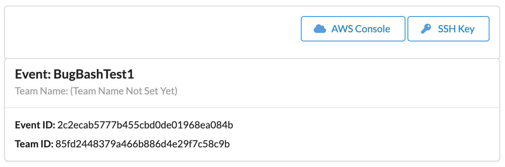
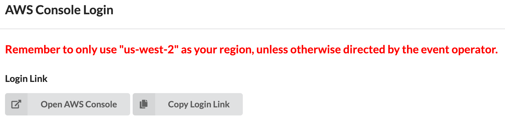
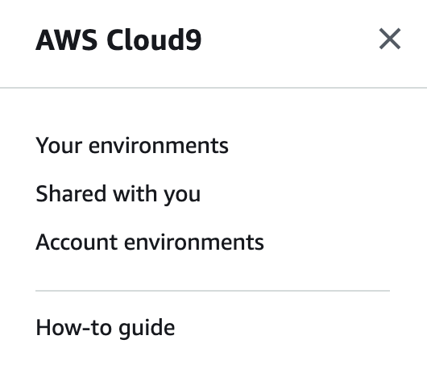
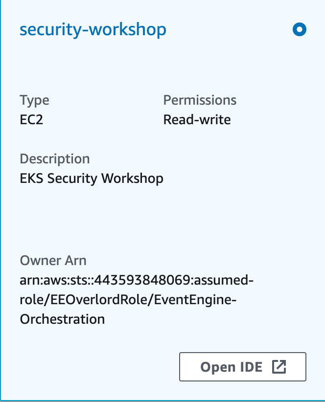

# eks-security-workshop
## Scenario
As a security engineer at Octank, a global conglomerate, you are responsible for overseeing the security of the compute environment. This includes the computing resources that have been provisioned in the AWS cloud. 

Octank recently launched a new e-commerce site for selling socks. The site, along with all of its dependencies, runs on an EKS cluster in the AWS cloud.  The cluster was initially built and configured without your involvement. Your manager has asked to you verify that the environment meets Octanks stringent security standards. 

Octank has been an appealing target for hackers in the past because of its popularity with consumers and its enormous wealth. You are concerned that the cluster was misconfigured, increasing the probability of a breach. You suspect that the cluster has already been compromised. Your job now is to: 

1. Review the security posture of the cluster
2. Find and isolate the breach
3. Formulate a theory about how or why it occurred
4. Collect evidence for a forensic investigation
5. Eliminate the threat to the environment
6. Implement security controls that decrease or eliminate a recurrence of the issue

## The environment
For this workshop, you will be given access to an AWS account with an EKS cluster. You will access that cluster through a Cloud9 workspace. A slightly modified version of the e-commerce application, [Sock Shop](https://microservices-demo.github.io/), has been deployed to the cluster and the EKS control plane logs have been enabled. Your first priority is to find and isolate the attack. 

The Cloud9 workspace has been granted administrative access to the Kubernetes API and is able to start SSH sessions with all the worker nodes in the cluster. An S3 bucket for storing forensic data has also been created and is exposed via the $FORENSICS_S3_BUCKET environment variable.

### The cluster
An EKS cluster has been provisioned in the us-west-2 region. The cluster's 3 worker nodes are distributed across 3 private subnets in the cluster VPC and are part of a [managed node group](https://docs.aws.amazon.com/eks/latest/userguide/managed-node-groups.html). The cluster API endpoint, i.e. the Kubernetes API, is accessible from within the VPC and the Internet. Access to the API server is secured using a combination of AWS Identity and Access Management (IAM) and native Kubernetes Role Based Access Control (RBAC). 

The cluster is accessible from a Cloud9 workspace which has already been provisioned for you. You'll find the workspace under "Shared with you" in the Cloud9 console. 

### The application
Sock Shop is a e-commerce application that consists of a multitude of microservices. The application's front-end is exposed as a LoadBalanced service and is accessible from the Internet. The services communicate with each other as depicted in this diagram:


## Instructions
The bulk of this workshop is unguided in that you will decide how to respond to the unfolding security incident at Octank. The workshop’s proctors will be available to periodically give you clues when needed or you can look at the workshop’s [GitHub](https://github.com/aws-samples/eks-security-compromised-cluster-remediation) repository for additional guidance. Once you’ve isolated and/or eliminated the threat from the cluster, you can follow the directions for implementing a few countermeasures that will enhance the security posture of your EKS cluster. This includes implementing OPA Gatekeeper, Falco and Falco Sidekick, and the Security Policy controller.

You will have approximately 2 hours to complete the workshop. 

## Resources & hints
Aside from this GitHub repository, feel free to use the [EKS Best Practices Guide for Security](https://aws.github.io/aws-eks-best-practices/security/docs/), the official Kubernetes documentation, or other external resources for ideas about how to respond. 

Your first “hint” is to increase your visibility of the cluster and its configuration (or misconfiguration). We recommend using [FairwindsOps/polaris](https://github.com/FairwindsOps/polaris), an open source project from Fairwinds, but you can use another solution if you so choose. See [Detective Controls - EKS Best Practices Guides](https://aws.github.io/aws-eks-best-practices/security/docs/detective/) for a list of potential options.

## Workshop Flow
The workshop is divided into different stages. In the [Identification](./Identification) stage you will implement solutions that will increase your visibility of the cluster, its configuration, and the workloads that are running on it. The idea is to determine whether your cluster has been compromised and how. In the [Containment](./Containment) stage you will isolate the compromise and capture evidence from the environment that can be used in a forensics investigation. In the [Eradication and Recovery](./Eradication_Recovery) stage you will remediate the compromised pod and eliminate the threat to your cluster. And finally in the [Implement Countermeasures](./Implement_Countermeasures) stage you will take stock of what has happened and implement a set of security controls, e.g. OPA/Gatekeeper, Falco, and the Security Profiles Operator, to lower the odds of a recurrence. 

## Capture the flag challenge (optional)
The attacker has left a message for you. If you want an additional challenge, find the attacker's bitcoin account number. 

**Hint**: follow the white rabbit to find the [secret](https://kubernetes.io/docs/tasks/run-application/access-api-from-pod/#without-using-a-proxy)

## Getting started
### Login to the Event Engine Dashboard
Before you can access the AWS account we've provisioned for you, you will need to login to Event Engine team dashboard. Start by opening your web browser and navigating to `dashboard.eventengine.run/login`. The workshop facilitators will share a 12-16 digit hash with you. Enter this value into the text field on the form and click the **Accept Terms & Login** button. 

When you get to the login screen, click the button labeled **Email One-Time Password (OTP)**. This will redirect you to another form prompting you to enter your email address. Type your email address in that field and click the **Send passcode** button. Wait for the email to arrive in your inbox. The email will contain a one-time passcode. Enter the passcode you receive and click the **Sign in** button. This will redirect you to the team dashboard. 

> Amazon Employees: If you are an Amazon Employee choose **Amazon Employees** at the **Sign in with** prompt instead of using **Email One-Time Password (OTP)**.

### Accessing the AWS Account
Once you are logged into the dashboard, click on the **AWS Console** button. 



This will pop-up another form to access the AWS Console. Click the **Open AWS Console** next. 



When you arrive at the console, type `cloud9` in the search field on the top navigation bar or find Cloud9 in the list of AWS services. From the Cloud9 console, click the 3 horizontal bars in the upper left corner to display the different option for accessing your Cloud9 workspace. Clicking **Account environments** will reveal the workspace you will use for the duration of this workshop. 



Click the **Open IDE** button. 



### Clone this GitHub repository
Start this workshop by cloning this repository to your Cloud9 workspace. 

```bash
git clone https://github.com/aws-samples/eks-security-compromised-cluster-remediation.git
```
## Conclusion
You should come away from this workshop with a better sense of: 

1. What controls to put in place to mitigate risks to your Kubernetes clusters
2. How to monitor the environment
3. How to respond when there’s a security incident, e.g. how to collect evidence for a forensics investigation
4. The importance of a good incident response plan

## Additional Resources
- [Cloud Native Security](https://cnsmap.netlify.app/) Map, explores Cloud Native Security concepts and how they are used
- [Amazon EKS Best Practices Guide for Security](https://aws.github.io/aws-eks-best-practices/security/docs/), provides advice about protecting information, systems, and assets that are reliant on EKS while delivering business value through risk assessments and mitigation strategies
- [KUBESEC.IO](https://kubesec.io/), recommended pod security settings
- [Cloud Native Security Whitepaper](https://github.com/cncf/tag-security/blob/main/security-whitepaper/cloud-native-security-whitepaper.md) (2020), provides organizations with a clear understanding of cloud native security
- [OWASP Kubernetes Security Cheat Sheet](https://cheatsheetseries.owasp.org/cheatsheets/Kubernetes_Security_Cheat_Sheet.html)
- [kubeaudit](https://github.com/Shopify/kubeaudit), a command line tool and a Go package to audit Kubernetes clusters for various different security concerns
